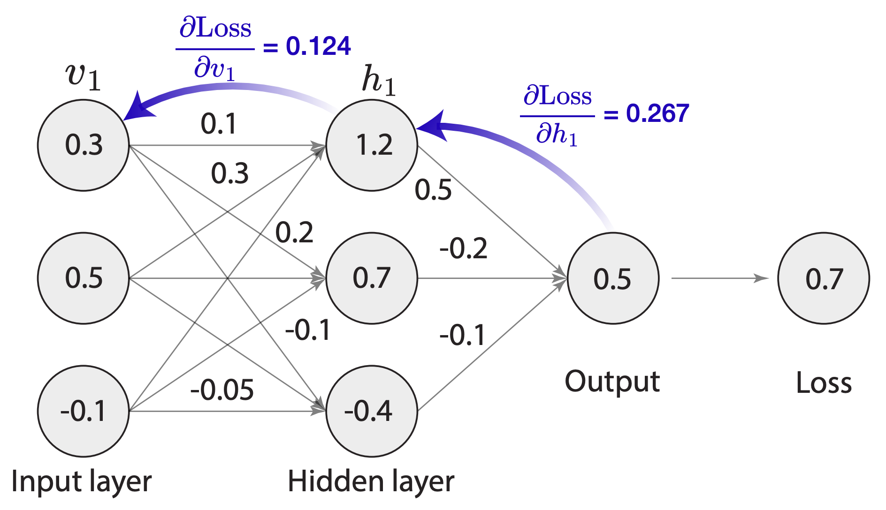
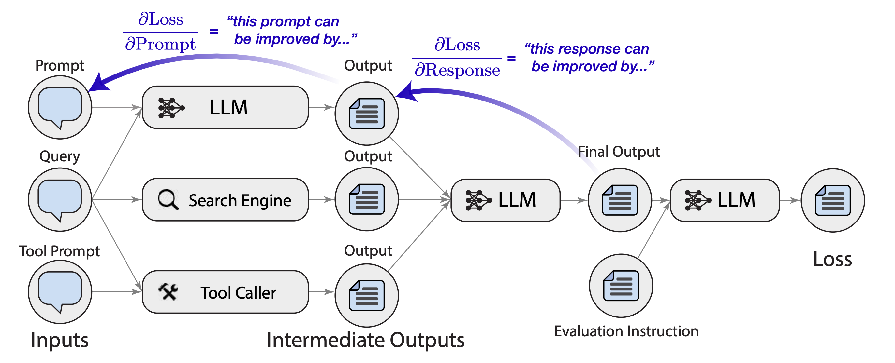

# tech-seminar-final (🎇 최종 우승 🎆)


Woori FIS Academy Tech Seminar Final

# TEXTGRAD


🎥 [Introduction to TextGrad, Code AI](https://youtu.be/Qks4UEsRwl0)
👩‍💻 [Github Repository](https://github.com/zou-group/textgrad)
🤗 [HuggingFace](https://huggingface.co/TextGrad)
📑 [Paper](https://arxiv.org/abs/2406.07496)

> Automatic "Differentiation" via Text

TextGrad는 LLM에서 제공하는 텍스트 피드백을 통해, 역전파를 구현하여 텍스트 데이터에 대한 미분을 수행할 수 있습니다.

## ♻️ BackPropagation



각 뉴런들은 이전의 모든 뉴런들의 결과라는 점을 통해, 출력에서 부터 거꾸로 입력까지 오차를 전파시키는 방법입니다.
이를 통해 각 뉴런의 가중치와 편향치를 조정할 수 있습니다.

## TextGrad

그렇다면 LLM의 결과값을 피드백으로 사용하여 역전파를 구현할 수 있을까?
→ 더 큰 수준에서의 미분을 수행할 수 있을까?

### Automatic “Differentiation” via Text

이미 많은 성과들이 LLM을 통해 이루어졌습니다.
올림피아드 수준의 문제를 풀거나, 코드를 생성하는 등의 작업들, 분자 구조를 예측하는 등의 작업들이 가능해졌습니다.
하지만 이러한 성과는 모두 전문가의 직관과 휴리스틱한 방법을 통해 이루어진 것입니다.

TextGrad는 이러한 전문가의 직관과 휴리스틱한 방법을 대체하고, 자동화하여 LLM의 수준을 끌어올리는 프레임워크입니다.

#### 역전파와 TextGrad는 어떻게 다른가?



역전파는 모델 자체의 성능을 향상시키는 방법입니다.

- 모델의 가중치와 편향치를 조정하여 모델의 성능을 향상시킵니다.
- 모델의 성능을 향상시키기 위해, 모델의 출력값을 최적화합니다.

반면 TextGrad는 모델을 포함한 시스템을 최적화하는 방법입니다.

> Here we use differentiation and gradients as a metaphor for textual feedback from LLMs.

기존 결과값을 바탕으로 LLM은 텍스트 피드백을 제공하고, 이를 통해 TextGrad는 모델을 최적화합니다.
미분과 그레디언트는 이 과정을 비유하기 위한 요소입니다.

### TextGrad, 필수 요소

> Our framework is built on the assumption
> that the current state-of-the-art LLMs are able to reason
> about individual components and subtasks of the system
> that it tries to optimize.

LLM은 시스템의 개별 구성요소와 하위 작업에 대해 추론할 수 있어야 합니다.
이러한 가정을 바탕으로 TextGrad는 시스템을 최적화합니다.

### 아이디어

> Prediction = LLM _ (**"Prompt"** + Question)
> Evaluation = LLM _ (Evaluation Instruction + Prediction)

> "Prompt + Question" **--LLM-→** "Evaluation Instruction + Prediction" **--LLM-→** "Evaluation"

### 핵심 개념

#### 텍스트 기반 자동 미분 📈

- 기존의 수치 기반 자동 미분 개념을 텍스트 도메인으로 확장한 것입니다.
- 계산 그래프의 각 노드는 텍스트 변수로 표현되며, 변수 간의 관계는 함수 호출로 정의됩니다.
- 이 함수들은 언어 모델 API 호출, 시뮬레이터, 외부 수치 해석기 등 다양한 형태를 가질 수 있습니다.

#### 자연어 피드백을 통한 역전파

- TextGrad의 가장 혁신적인 부분입니다.
- 기존의 수치 그래디언트 대신, 언어 모델이 생성한 자연어 피드백이 역전파됩니다.
- 이 피드백은 각 변수를 어떻게 변경해야 전체 시스템의 성능이 향상될지에 대한 구체적이고 해석 가능한 제안을 포함합니다.

#### 텍스트 기반 경사 하강법(Textual Gradient Descent, TGD)

- 자연어 피드백을 바탕으로 변수를 실제로 업데이트하는 과정입니다.
- TGD는 현재 변수 값과 수집된 피드백을 입력으로 받아 개선된 변수 값을 생성합니다.
- 이 과정에서 언어 모델의 추론 능력이 활용되어 단순한 수치 연산 이상의 복잡한 최적화가 가능해집니다.

### 주요 구성 요소

> TextGrad의 주요 구성 요소는 **변수(Variables)**, **함수(Functions)**, **최적화기(Optimizer)**로 나눌 수 있습니다.

#### 변수(Variables)

> 계산 그래프의 노드.

- **값(Value):** 변수가 포함하는 실제 텍스트 데이터
- **역할 설명(Role description):** 변수의 역할을 설명하는 문자열
- **그래디언트(Gradients):** 역전파 과정에서 수집된 자연어 피드백
- **선행자(Predecessors):** 해당 변수를 생성하는 데 사용된 변수들의 집합
- **requires_grad:** 역전파 시 그래디언트 계산 여부를 결정하는 플래그

#### 함수(Functions)

> 변수들 간의 관계를 정의.

TextGrad에서 가장 중요한 함수는 LLMCall로, 언어 모델 API를 호출하여 입력 변수로부터 출력 변수를 생성합니다.
함수는 forward와 backward 메서드를 정의해야 하며, 이를 통해 순전파와 역전파 동작을 구현합니다.

#### 최적화기(Optimizer)

> 수집된 피드백을 바탕으로 변수를 실제로 업데이트.

TextGrad의 핵심 최적화기는 **Textual Gradient Descent(TGD)**

- 현재 변수 값과 수집된 피드백을 입력으로 받음
- 언어 모델을 활용하여 개선된 변수 값을 생성
- 제약 조건, 모멘텀 등 다양한 최적화 기법 지원

이러한 구성 요소들이 유기적으로 작동하여 TextGrad의 최적화 프로세스를 구현합니다.

### TextGrad, 활용 사례 👀

TextGrad는 다양한 도메인에서 그 효과성을 입증했습니다.

1. 코드 최적화: LeetCode의 어려운 코딩 문제 해결에 적용되어 기존 방법 대비 20% 성능 향상을 달성했습니다.

   - TextGrad는 코드의 정확성과 실행 시간을 동시에 개선할 수 있었습니다.

2. 문제 해결 최적화: Google-Proof Question Answering 벤치마크에서 GPT-4의 zero-shot 정확도를 51%에서 55%로 향상시켰습니다.

   - 복잡한 과학 질문에 대한 해답을 반복적으로 개선하는 데 성공했습니다.

3. 프롬프트 최적화: 다양한 추론 작업에서 GPT-3.5의 성능을 GPT-4에 근접하게 끌어올렸습니다.

   - 최적화된 프롬프트를 통해 더 저렴한 모델로도 고성능을 달성할 수 있었습니다.

4. 분자 구조 최적화: 원하는 약물 유사성(druglikeness)과 단백질 결합 친화도를 가진 새로운 소분자를 설계했습니다.

   - 이는 신약 개발 과정을 가속화할 수 있는 잠재력을 보여줍니다.

5. 방사선 치료 계획 최적화: 전립선 암 환자를 위한 방사선 치료 계획을 최적화했습니다.

   - 목표 부위에 대한 적절한 선량과 부작용 감소를 동시에 달성했습니다.

### 발표자료 📊

[프레젠테이션 Link](./ppt/presentation.md)

### Working Examples 🛠

`./streamlit` 디렉토리에는 TextGrad를 활용한 예제들이 포함되어 있습니다.

```shell
# Install requirements
pip install -r requirements.txt

# Run Streamlit app
streamlit run multimodal_solution.py
```

`./Tutorials` 디렉토리에는 TextGrad의 사용법을 설명하는 공식 튜토리얼이 포함되어 있습니다.

- Juptyer Notebook을 통해 실행할 수 있습니다.
